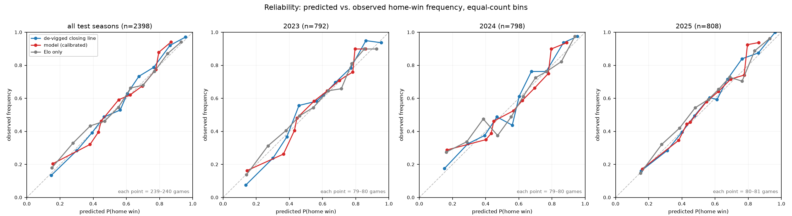

# Results — held-out seasons 2023–2025

> **The headline is a gap.** On 2398 held-out games the model's Brier is 0.1913 against the de-vigged closing line's 0.1763 — short of the line by 0.0149.
>
> The model does not beat the market and is not a betting tool. A score better than the closing line here would be treated as evidence of leakage, not as a result.

Generated by `make evaluate`. Machine-readable copy: [`metrics.json`](metrics.json).

## The game set

- **2398 games**: test seasons, FBS vs FBS, and a Vegas benchmark present — the intersection. Every system is scored on this one frame, in one order.
- Per season: 2023 — 792, 2024 — 798, 2025 — 808
- **0 games dropped** for having no closing line from any provider.
- FBS-vs-FCS games are excluded by the Phase 5 model frame (RISKS #3), before this phase sees the data.
- Benchmark provider on these games: Bovada (2369), consensus (29). The Phase 2 ladder switches provider inside the test period; the counts are here so that is visible rather than buried.

### Coverage, reported rather than assumed

The most recent season being incomplete in the source would shrink the test set toward the easier, earlier part of a year, and would still produce a plausible number. So what each season actually contains is printed rather than trusted:

| Season | Regular | Postseason | Regular weeks | Last kickoff |
|---|---|---|---|---|
| 2023 | 750 | 42 | 1–15 | 2024-01-09 |
| 2024 | 752 | 46 | 1–16 | 2025-01-21 |
| 2025 | 762 | 46 | 1–16 | 2026-01-20 |

## Overall

| System | Brier | Log loss |
|---|---|---|
| model (calibrated) | 0.1913 | 0.5631 |
| de-vigged closing line | 0.1763 | 0.5223 |
| naive home baseline | 0.2427 | 0.6784 |
| Elo only | 0.1902 | 0.5589 |

**Gap (model − line): +0.0149 Brier, +0.0407 log loss.**

The model closes **77.5%** of the distance between the naive home baseline and the de-vigged closing line (`(brier_naive - brier_model) / (brier_naive - brier_vegas)`). That ratio is two small differences divided by each other, so it moves a lot on little; it is not a percentage of anything anyone can bet on.

## Per season

Reported separately rather than pooled, because a calibrator fitted on one season (2022) drifting on later ones is a named risk (`RISKS.md` #4), and pooling is exactly what would hide it.

| Season | n | Model | Line | Naive | Elo only | Gap | Skill |
|---|---|---|---|---|---|---|---|
| 2023 | 792 | 0.1854 | 0.1715 | 0.2437 | 0.1862 | +0.0139 | 80.7% |
| 2024 | 798 | 0.1999 | 0.1819 | 0.2430 | 0.1985 | +0.0180 | 70.5% |
| 2025 | 808 | 0.1885 | 0.1756 | 0.2413 | 0.1858 | +0.0129 | 80.4% |

## Calibration did not generalise

Phase 5's isotonic calibrator was fitted on 2022 and its improvement there (0.2024 → 0.1951 Brier) was measured on the season it was fitted on. `RISKS.md` #25 said before this was run that the number is a fit and not an estimate. These seasons are the test, and the calibrator **cost** +0.0029 Brier against leaving the model raw — in all three seasons, in the same direction.

| Season | Raw | Isotonic (shipped) | Platt |
|---|---|---|---|
| overall | 0.1883 | 0.1913 | 0.1894 |
| 2023 | 0.1829 | 0.1854 | 0.1847 |
| 2024 | 0.1978 | 0.1999 | 0.1972 |
| 2025 | 0.1844 | 0.1885 | 0.1862 |

The mechanism is visible rather than inferred. Isotonic regression is a step function, and one fitted on 776 games has few steps: it collapses the booster's 2386 distinct outputs on these games into **62**, with 405 games landing on the single value 0.7955. The damage concentrates where the steps are widest — on the 367 games the raw model called at over 0.85, the home team won 92.9% of the time, the raw model said 91.4%, and the calibrated model said 84.4%. Platt scaling, with two parameters instead of an arbitrary monotone step function, costs +0.0010 — less, and still worse than raw.

**This does not change the shipped model.** The headline above is the calibrated model because that is what Phase 5 shipped, and picking the raw model now — on the strength of its test-season score — would be selecting a model on the test set, which is the same mistake as tuning on it, one phase later. Whether to keep the calibrator is a decision for a later phase, made on data this one is not allowed to touch.

## The Elo baseline is close

The Elo-only baseline scores 0.1902, which is **better than the shipped calibrated model** (0.1913) and worse than the raw booster (0.1883). Twenty-six features and a gradient-boosted tree buy very little over one rating difference and a fitted logistic scale, and after the calibrator they buy less than nothing. Stated here because it is the most useful thing in this document: it says the rolling box-score features are carrying almost no independent signal, which is a finding about the features and a starting point for the next iteration, not a defect in the evaluation.

For what it is worth as a sanity check, the scale fitted on training seasons came out at 401.5 Elo points per decade of odds, against the definitional 400 the ratings are built under — the rating system and its probability reading agree.

## Reliability

10 equal-count bins — equal-count bins over the sorted predicted probability. Equal-count rather than equal-width because predictions pile up in the middle: equal-width bins would put a handful of games in the tail bins and draw them the same size as bins holding hundreds. Bin counts are annotated on the plot for the same reason.

## Robustness: the benchmark itself

The benchmark is spread-derived for every season by design (`RISKS.md` #15). On the **2337** test games that also carry a two-sided moneyline (excluding 5 rows flagged by `RISKS.md` #16 and 56 with no moneyline), the de-vigged moneyline is a second reading of the same market:

| Benchmark | Brier | Log loss | Gap to model |
|---|---|---|---|
| spread-derived (shipped) | 0.18019 | 0.53369 | +0.01494 |
| moneyline-derived | 0.18020 | 0.53440 | +0.01494 |

The two readings of the market differ by 0.000008 Brier in the gap they produce, which is four orders of magnitude below the gap itself. The conclusion does not depend on how the benchmark was built.

The plan asked for moneyline-sourced vs spread-fallback benchmark games. Phase 2 made p_home_devig spread-derived for every season on purpose (RISKS #15), so that split has no members. This asks the same question the other way round.

## Limitations

- Not a betting tool. The model scores worse than the de-vigged closing line, and the line already has vig on top of it. Nothing here has been evaluated against closing-line value, bet sizing, or transaction costs, and no such claim is made.
- The benchmark is spread-derived, not a traded price. `p_home_devig` converts a closing spread through a normal margin model with a fixed sigma fitted on 2014-2021 (RISKS #15, #17). It is a good yardstick, not the market's own probability.
- One model, one split, one run. There is no repeated-seed study and no confidence interval on any gap reported here. Differences of a thousandth of a Brier point between systems are not resolvable at this sample size.
- Hyperparameters are barely tuned in any meaningful sense. The 24-point grid spans 0.0053 in mean forward-CV log loss best to worst (RISKS #23); the chosen point is defensible, not discovered.
- The isotonic calibrator did not generalise. Fitted on a single season of 776 games (RISKS #4, #25), it improved 2022 in-sample and made every held-out season worse than leaving the model raw; the measured cost and the mechanism are in `results_table.md`. The headline is still the calibrated model, because re-picking the raw one on the strength of its test-season score would be selecting a model on the test set.
- A one-parameter logistic of the Elo difference scores better than the shipped calibrated model on these seasons. The 26-feature booster earns its keep only before calibration, and only narrowly, which says the rolling box-score features carry little signal that Elo does not already carry.
- Elo is cold-started in 2014 and every FCS opponent shares one fixed 1200 rating (RISKS #18, #19, #22), so the rating features are noisiest exactly where the training data begins and are inflated for teams fresh off an FCS game.
- Plays are reconstructed as rushing attempts plus pass attempts, not observed (RISKS #21), so every yards-per-play and pace feature rests on a derived denominator that will not match every published play count.
- Team strength is represented by Elo, rest, and rolling box-score rates only. There are no injuries, no weather, no personnel, no travel distance, and no market information of any kind — that last one by rule, since the line is the benchmark.

See [`model_card.md`](model_card.md) for intended use, and `RISKS.md` for the full risk register these are drawn from.
